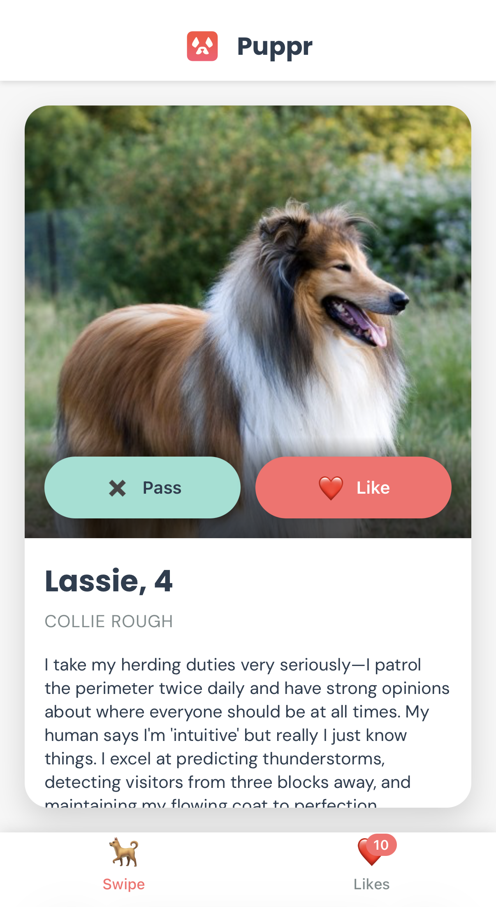
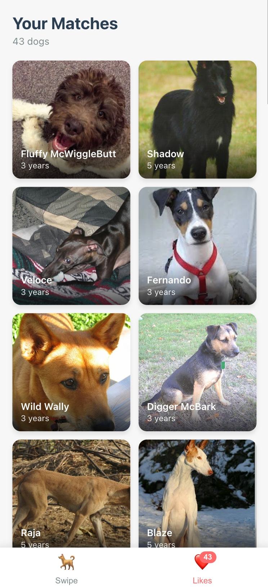
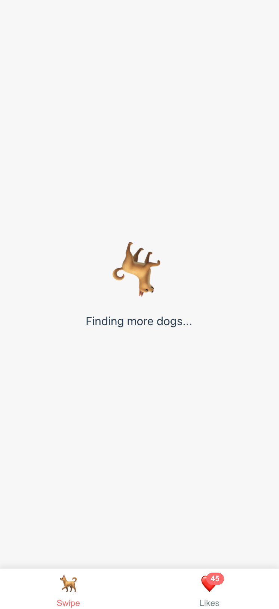

# Puppr 🐕

## A playful dog dating swipe app with AI-generated profiles

<div align="center">
  <table border="0">
    <tr>
      <td align="center">
        
        <br>
        <em>Swipe View</em>
      </td>
      <td align="center">
        
        <br>
        <em>Likes Gallery</em>
      </td>
      <td align="center">
        
        <br>
        <em>Loading</em>
      </td>
    </tr>
  </table>
</div>

## About Puppr

Puppr is a playful swipe app that pairs the dopamine loop of dating apps with AI-generated dog bios. It serves as an approachable case study for CS students who want to see how a clear spec plus AI tooling can take an idea from 0 → 1 in a single afternoon: ~2 hours refining specs, <1 hour of live coding, and ~1 hour of polish/deployment.

**Build highlights**
- Spec‑driven workflow: requirements in `specs/` powered the entire implementation and kept scope realistic
- AI-assisted implementation: Claude Code + Warp IDE handled most of the typing while humans steered, debugged, and reviewed
- Delight-first UX: expressive bios, swipe interactions, and cached likes make the demo feel real despite the tight timeline

## Prerequisites

✅ **Required:**
- Node.js 20+ ([Download](https://nodejs.org/))
- Anthropic API key ([Get one free](https://console.anthropic.com/))

📚 **You should know:**
- React basics (components, hooks)
- Node.js basics (npm, Express)

## Quick Start

| Step | Command | Why it matters |
| --- | --- | --- |
| Install deps | `npm install` | Installs both workspaces via the root npm workspace |
| Configure env | `npm run configure-env` | Copies `.env.sample` if missing and stores your `ANTHROPIC_API_KEY` |
| Run dev servers | `npm run dev` | Launches backend + frontend together with shared logging |
| Smoke test API | `curl -s http://localhost:3001/api/health`<br>`curl -s http://localhost:3001/api/dog` | Confirms the server can serve health and profile data |

Need a clean rebuild? Run `npm run setup`. Default URLs: API `http://localhost:3001`, web app `http://localhost:5173` (configure via `.env` / `VITE_API_URL` as needed).

## Table of Contents

[About](#about-puppr) · [How It Works](#how-it-works---api-integration) · [SDD](#spec-driven-development-sdd) · [Workflow](#project-workflow--structure) · [Getting Started](#getting-started) · [API](#api-endpoints) · [Troubleshooting](#troubleshooting) · [License](#license) · [Credits](#credits)

## How It Works - API Integration

Two external services power every swipe:
- **[Dog CEO API](https://dog.ceo/dog-api/documentation/)** – returns a random image and lets us infer the breed from the URL path
- **[Anthropic TypeScript SDK](https://github.com/anthropics/anthropic-sdk-typescript)** – calls Claude Haiku 4.5 with a JSON-only prompt, retries on errors, and outputs the profile details (name, age, bio, interests, goals, traits)

**Flow**
1. Request `GET /api/dog`
2. Backend pulls an image from Dog CEO and extracts the breed from the URL
3. Breed name feeds a Claude prompt; the SDK enforces JSON structure, strips code fences, and retries on rate limits/server hiccups
4. The server merges `{ image, breed, profile }` and returns it to the client
5. Frontend keeps the “next dog” prefetched so swipe latency stays near-zero

## Spec-Driven Development (SDD)

SDD treats the spec as the executable blueprint: describe the product crisply, then let AI agents implement against that contract. Puppr leaned on this approach to keep the rapid build on-rails.

**SDD loop**
1. Specify outcomes and UX
2. Plan architecture + constraints
3. Taskify the spec for reviewable chunks
4. Implement with AI + human oversight

**Why it works** – minimizes hallucinations, keeps architecture intentional, and makes pivots as simple as editing the spec.

> For Puppr, about two hours were spent co-researching with Claude Code to evolve `specs/mvp-specification.md` into the tighter `specs/rapid-prototype-spec.md` before any code was generated. Handing that lean spec to the agent made the live coding session a true “one-shot.”

**More to read**: [Spec-Driven Development (Medium)](https://medium.com/@shenli3514/spec-driven-development-sdd-is-the-future-of-software-engineering-85b258cea241) · [GitHub Spec Kit](https://github.com/github/spec-kit) · [Microsoft Spec Kit deep dive](https://developer.microsoft.com/blog/spec-driven-development-spec-kit)

## Project Workflow & Structure

| Folder | Purpose | Highlights |
| --- | --- | --- |
| `client/` | Vite + React UI | Swipe flow, likes gallery, prefetched cards |
| `server/` | Express API | Orchestrates Dog CEO + Claude calls with retries |
| `specs/` | Living requirements | `mvp-specification` (vision) → `rapid-prototype` (build-ready scope) |
| `ai-docs/` | Local API references | Downloaded docs give AI agents deterministic, offline context |

**Workflow snapshot**
1. Draft spec → refine until it fits a “one-shot” build
2. Feed spec + local docs into Claude Code to implement tasks
3. Review/patch outputs, then polish UX
4. Keep specs + README updated so future changes start with intent, not guesswork

**Why `ai-docs/` matters**
- Local copies of API docs and SDKs keep the LLM grounded while offline
- Agents can cite exact interfaces/examples without hallucinating
- Students can drop new documentation there to guide future AI-assisted work

## What You'll Learn

- **Rapid prototyping playbook** – translate a spec directly into a shippable MVP
- **AI integration pattern** – `server/services/profileGenerator.js` shows guarded prompts, retries, and JSON validation
- **Data flow trace** – follow SwipeView → `api.js` → Express → Dog CEO + Anthropic → client cache
- **Spec hygiene** – compare `mvp` vs `rapid-prototype` specs to see how scope was trimmed without losing intent
- **Tooling stack** – Claude Code + Warp IDE for implementation, npm workspaces for orchestration

## AI Coding Toolkit

- Puppr itself was built using **[Claude Code](https://www.claude.com/product/claude-code)** (as the agent) and **[Warp](https://www.warp.dev/)** (as the terminal/IDE). The tools below are additional options if you want to experiment; each has different strengths and tradeoffs.

- [Cursor 2.0](https://cursor.com/) – VS Code-style editor with inline/chat agents; great when you want tight IDE integration
- [Replit Agent 3](https://replit.com/agent3) – browser-based agent that can scaffold projects and deploy to Replit-hosted infra quickly
- [Gemini CLI](https://cloud.google.com/gemini/docs/codeassist/gemini-cli) – Google’s command-line assistant for multi-model workflows and tight GCP integration
- [OpenAI Codex CLI](https://openai.com/codex/) – classic code-generation CLI with strong autocomplete; handy for quick script prototyping


## Features

- 🐕 **Random Dog Profiles** - Fetches random dog images from Dog.CEO API
- 🤖 **AI-Generated Bios** - Claude Haiku 4.5 creates witty, breed-appropriate dating profiles
- 👍 **Swipe Interface** - Simple button-based swiping (Pass/Like)
- 📱 **Mobile-First** - Optimized for mobile viewports (375px-428px)
- 💾 **Session Storage** - Liked dogs persist during your session
- ⚡ **One-Ahead Prefetching** - Next dog loads in background for instant swiping
- ✨ **Smooth Animations** - CSS-based transitions for cards and views

## Tech Stack

### Frontend
- React 18
- Vite (build tool)
- Vanilla CSS (mobile-first)

### Backend
- Node.js 20+
- Express.js
- Anthropic SDK (Claude Haiku 4.5)
- Dog.CEO API

## Project Structure

```
puppr/
├── client/                 # React frontend
│   ├── src/
│   │   ├── components/
│   │   │   ├── SwipeView.jsx
│   │   │   ├── DogCard.jsx
│   │   │   ├── LikesGallery.jsx
│   │   │   └── BottomNav.jsx
│   │   ├── services/
│   │   │   ├── api.js
│   │   │   └── storage.js
│   │   ├── App.jsx
│   │   ├── main.jsx
│   │   └── index.css
│   ├── index.html
│   ├── vite.config.js
│   └── package.json
├── server/                 # Node/Express backend
│   ├── services/
│   │   ├── dogService.js
│   │   ├── dogAPI.js
│   │   └── profileGenerator.js
│   ├── errors.js
│   ├── server.js
│   └── package.json
├── specs/                  # SDD specifications
│   ├── mvp-specification.md
│   └── rapid-prototype-spec.md
├── ai-docs/                # Local API documentation for AI context
│   ├── dog-ceo-api/
│   └── anthropic-sdk-typescript/
├── .env.sample
├── .gitignore
└── README.md
```

## Getting Started

### Prerequisites

- Node.js 20+ installed
- Anthropic API key ([Get one here](https://console.anthropic.com/))

### Installation

> TL;DR: run `npm install` from the repo root to install both workspaces (`client` and `server`). The manual steps below are available if you prefer installing each project yourself.

1. **Clone the repository**

```bash
gh repo clone king-of-the-grackles/Puppr
cd Puppr
```

2. **Set up environment variables**

Create a `.env` file in the root directory:

```bash
# Copy the sample file
cp .env.sample .env
```

Edit `.env` and add your Anthropic API key:

```
ANTHROPIC_API_KEY=your_api_key_here
PORT=3001
NODE_ENV=development
CORS_ORIGIN=http://localhost:5173
```

3. **Install backend dependencies**

```bash
cd server
npm install
```

4. **Install frontend dependencies**

```bash
cd ../client
npm install
```

### Running the App

```bash
npm run dev
```

This single command uses `concurrently` to launch the backend and frontend, prints service URLs, and restarts when files change.

### Testing

Open your browser to `http://localhost:5173` and:

1. You should see a dog card with an AI-generated profile
2. Click "Pass" or "Like" to see the next dog
3. Click the heart icon (💙) in the bottom nav to view your likes
4. Each profile includes: name, age, bio, interests, relationship goals, and personality traits

**For mobile testing:**
- Use Chrome DevTools (F12) and toggle device toolbar
- Select iPhone SE, iPhone 12 Pro, or iPhone 14 Pro Max
- Or test on a real device at your local IP

## Configuration

- Server (`.env` in repo root)
  - `ANTHROPIC_API_KEY` (required): server will not start without a valid key
  - `PORT` (default `3001`): backend port
  - `NODE_ENV` (default `development`): enables request logging in dev
  - `CORS_ORIGIN` (default allows `http://localhost:5173` and `http://localhost:5174`): set to your frontend origin in production
  - Run `npm run configure-env` for an interactive prompt that writes to `.env`
- Client (`client/.env`)
  - `VITE_API_URL` (default `http://localhost:3001`): base URL for API requests; set to your deployed backend in production

## API Endpoints

### Backend Endpoints

- `GET /api/health` - Health check
- `GET /api/dog` - Fetch random dog with AI-generated profile

**Response Format:**
```json
{
  "success": true,
  "data": {
    "id": "1699383820123-abc",
    "imageUrl": "https://images.dog.ceo/breeds/retriever-golden/n02099601_100.jpg",
    "breed": "Golden Retriever",
    "profile": {
      "name": "Charlie",
      "age": 4,
      "bio": "Athletic golden boy who believes every stranger is just a friend they haven't met yet.",
      "interests": ["Swimming", "Fetching", "Making friends", "Belly rubs"],
      "lookingFor": "Someone who throws the ball... and then throws it again",
      "traits": ["Loyal", "Energetic", "Friendly"]
    },
    "timestamp": 1699383820123
  }
}
```

## Troubleshooting

### Common Issues - Quick Fixes

**🔴 Blank screen in browser?**
→ Check that both servers are running (you should see "Backend at :3001, Frontend at :5173" in your terminal)

**🔴 "Failed to generate profile" error?**
→ Verify your `ANTHROPIC_API_KEY` is set correctly in the `.env` file

**🔴 "Finding more dogs..." stuck for >10 seconds?**
→ Check server logs for API errors, restart with `npm run dev`

### Detailed Troubleshooting

- Server fails to start with Anthropic error
  - Cause: `ANTHROPIC_API_KEY` not set or invalid
  - Fix: Set a valid key in `./.env` (server requires it at startup)

- Browser CORS error calling API
  - Cause: Frontend origin not allowed by server CORS
  - Fix: Set `CORS_ORIGIN` in `./.env` (e.g., `http://localhost:5173` or your deployed frontend URL)

- `GET /api/dog` returns 500
  - Cause: Upstream rate limiting, network timeout, or JSON parse failure
  - Fix: Retry; verify `ANTHROPIC_API_KEY`; check server logs; the server includes retry/backoff and JSON validation

- Frontend calls wrong API URL
  - Cause: `VITE_API_URL` not set for production
  - Fix: Set `VITE_API_URL` to your deployed backend (e.g., `https://api.example.com`)

- Port already in use
  - Cause: Another process on `3001` or `5173`
  - Fix: Change `PORT` in server `.env` or pass `--port` to Vite dev server

## License

MIT

## Credits

- Dog images: [Dog.CEO API](https://dog.ceo/)
- AI profiles: [Anthropic Claude](https://www.anthropic.com/)
- Built with 💙 for dog lovers everywhere

---

**Note:** This is a rapid prototype demo application demonstrating Spec-Driven Development and AI-assisted coding workflows. See the spec files for full technical details and implementation notes.
